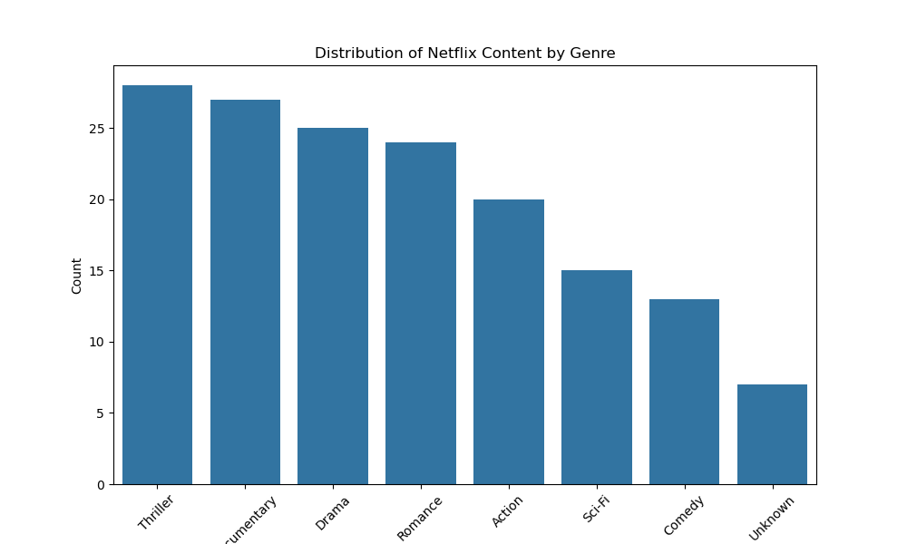
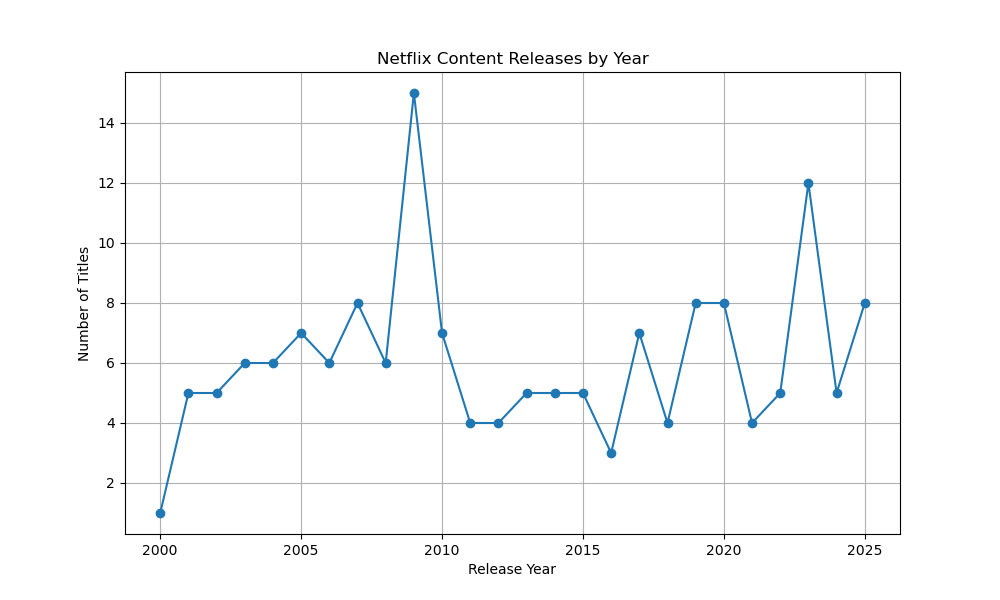

# Netflix Content Analysis Dashboard
Python project analyzing 250 Netflix titles to uncover trends in genres, release years, and viewer ratings.

## Features
- Data cleaning: Handles missing values and duplicates.
- EDA: Analyzes genre distribution, release trends, and ratings by country.
- Visualizations: Bar, line, and box plots using Matplotlib, Seaborn, and Plotly.
- Dashboard: Interactive Dash app for filtering by genre.

## Sample Visualizations

## Files
- netflix_analysis.ipynb: Jupyter Notebook with code.
- netflix_data.csv: Dataset with 250 rows.
- genre_distribution.png: Bar chart.
- release_trend.png: Line chart.
- ratings_by_country.html: Interactive Plotly chart.

## How to Run
1. Install dependencies: `pip install pandas matplotlib seaborn plotly dash`.
2. Run `netflix_analysis.ipynb` in VS Code.
3. Open `ratings_by_country.html` or run the Dash app for the dashboard.